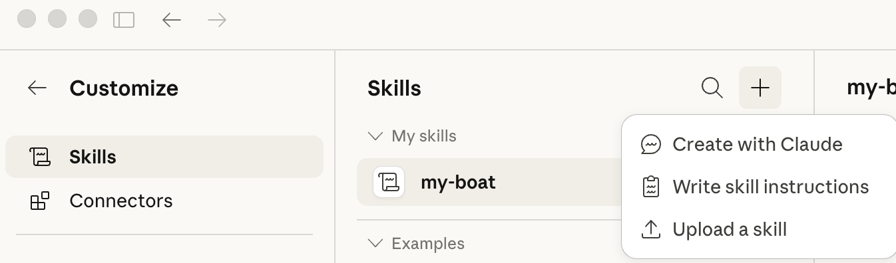

# Skills

Claude skills for personal use.

## my-boat

Reference profile for the Bavaria Cruiser 36 (2011) — vessel details, engine specs, sailing area, and maintenance notes. Used to tailor Claude's advice to the specific boat and Scottish waters.

### Install

Drag `my-boat.skill` into Claude.ai → Settings → Skills.

### Edit

Edit `my-boat/SKILL.md` directly, then wait for Github Actions to automatically repackage, the download skill from GitHub and re-install in Claude
